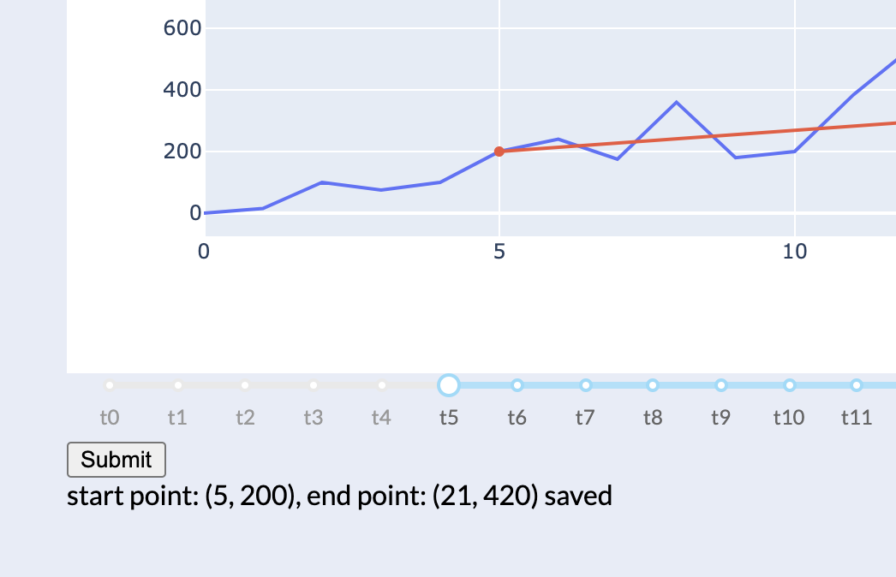

# Introduction
The main chart with range sidebar which decide cut line start/end point. The second image show we can save cut line information using callback.

# Structure
Application entry point: wsgi.py[[2]](https://en.wikipedia.org/wiki/Web_Server_Gateway_Interface)

# Requirements
1. Flask
2. Plotly

# Reference
1. [[Article] Flask web with plotly](https://hackersandslackers.com/plotly-dash-with-flask/) 
2. [[Wikipedia] Web Server Gateway Interface (WSGI)](https://en.wikipedia.org/wiki/Web_Server_Gateway_Interface)